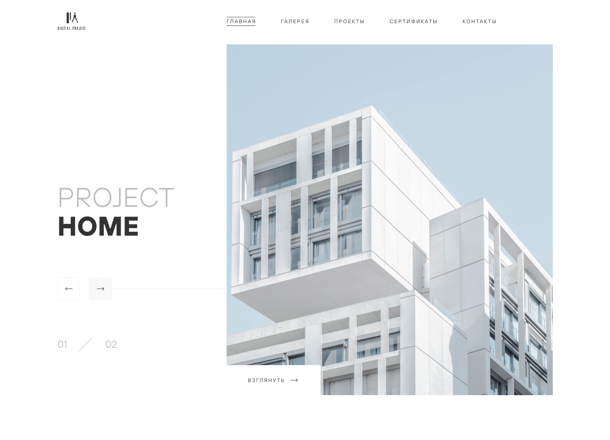

# Digital Projects Agency
## About
This landing page of Digital Projects Agency.

## Technology stack
## To preview the page, follow the link below

## Preparing a project

1. Make sure you have an LTS version of Node.js installed on your computer.
   [Download and install](https://nodejs.org/en/) if needed.
2. Clone this repository.
3. Change the folder name from `parcel-project-template` to the name of your project.
4. Create a new empty GitHub repository.
5. Open the project in VSCode, launch the terminal and link the project to the GitHub repository
   [by instructions](https://docs.github.com/en/get-started/getting-started-with-git/managing-remote-repositories#changing-a-remote-repositorys-url).
6. Install the project's dependencies in the terminal with the `npm install` command.
7. Start development mode by running the `npm start` command.
8. Go to [http://localhost:1234](http://localhost:1234) in your browser.
   This page will automatically reload after saving changes to the project files.